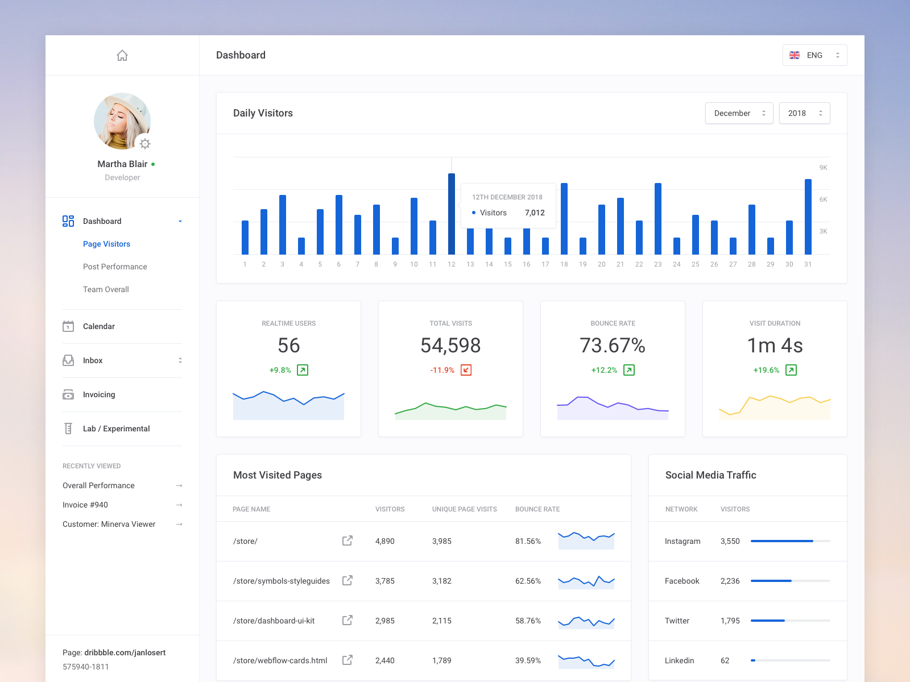

# Reactjs Dashboard Example

This project was bootstrapped with [Create React App](https://github.com/facebook/create-react-app).

## Available Scripts

### `npm start`

This will run the app in the development mode. 
Open [http://localhost:3000](http://localhost:3000) to view it in the browser.

### `npm run build`

Builds the app for production to the `build` folder. 
It correctly bundles React in production mode and optimizes the build for the best performance.

## Live Demo

You can see the working demo of this app by clicking on [this link](https://github.com/ms-yogi/reactjs-dashboard). All data used to populate charts is a mock data saved in the json file in the same project.

## Inspiration

For this app, following design template has been used 

## Libraries Used

- [node-sass](https://github.com/sass/node-sass)
- [momentjs](https://momentjs.com/)
- [bootstrap](https://getbootstrap.com/)
- [react-bootstrap](https://react-bootstrap.github.io/)
- [react-router-dom](https://reacttraining.com/react-router/web/guides/quick-start)
- [recharts](http://recharts.org/en-US/)
- [eslint](https://eslint.org/)

## For any suggestions
Please reach out! 